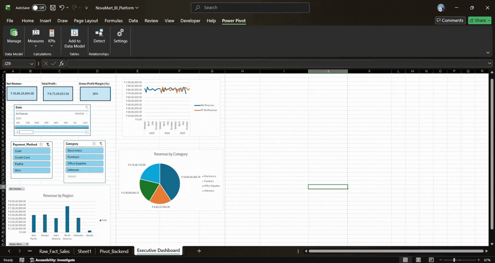
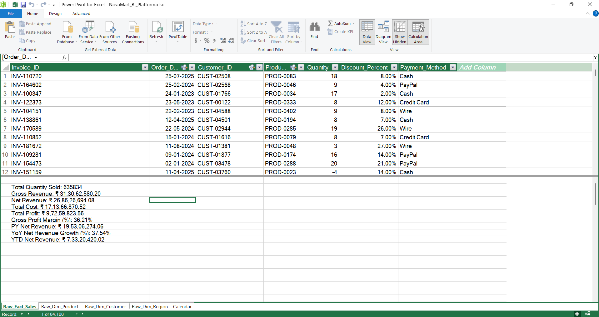

# NovaMart Global - Enterprise BI & Analytics Platform

*If the GIF does not load, view the [Static Dashboard Screenshot](images/dashboard_final.png) or the [PDF Preview](NovaMart_BI_Platform.pdf).*

## Project Overview
An end-to-end Business Intelligence solution engineered for a simulated global retail company. This project replaces disjointed departmental spreadsheets with a centralized, single-version-of-truth data model to track revenue, profitability margins, and Year-over-Year growth.

**Tools Used:** Excel Power Query (M), Power Pivot, Data Modeling, DAX, Advanced CUBE Functions.

---

## The Business Problem
The NovaMart C-suite was relying on fragmented reports causing conflicting data in executive meetings. They lacked visibility into true regional performance, active product margins, and historical time-intelligence tracking. The objective was to build an interactive executive dashboard entirely independent of vulnerable flat-file PivotTables.

---

## Solution Architecture

### 1. ETL & Data Engineering (Power Query)
Processed roughly 85,000 rows of raw, dirty transactional data.
* Standardized inconsistent categorical text and resolved data type formatting.
* Identified and quantified orphan records (96 missing customers) using a Left Anti Join to preserve financial grand totals without breaking dimensional logic.
* Handled duplicate primary keys and null financial values prior to model loading.

### 2. Data Modeling (Power Pivot)
Abandoned flat-file reporting to architect a highly efficient Star Schema utilizing the VertiPaq memory engine.
* Built a dedicated `Dim_Calendar` table for contiguous Time Intelligence calculations.
* Established strict 1-to-Many cross-filter relationships flowing from Dimension tables to the central `Fact_Sales` table.

### 3. Analytical Engine (DAX)
Wrote explicit DAX measures to calculate dynamic business logic, ensuring reusability across the enterprise model.
* **Iterators:** Utilized `SUMX` for row-by-row transactional evaluation (e.g., Gross Revenue = Quantity * List Price).
* **Safe Division:** Implemented `DIVIDE` to prevent Zero-Denominator errors in margin percentages.
* **Time Intelligence:** Leveraged `CALCULATE` paired with `SAMEPERIODLASTYEAR` and `TOTALYTD` for advanced context transition to calculate YoY Growth and Accumulating targets.

### 4. Presentation Layer (CUBE Functions & UI)
Designed an application-like Executive Dashboard focused on immediate high-level insights.
* Engineered KPI cards using `CUBEVALUE` functions, extracting DAX measures directly from the internal model to bypass fragile PivotTable layouts.
* Synchronized global Timeline and Slicer controls to filter multiple distinct objects simultaneously.

---

## Key Business Insights
1. **Top Driver:** North America generated the highest raw Net Revenue volume.
2. **Profitability:** While Electronics drive volume, the Furniture category yielded the highest Gross Profit Margin at over 38%.
3. **Data Governance:** The ETL process revealed critical gaps in the source CRM system, identifying millions in revenue tied to unassigned Customer IDs, highlighting the need for stricter front-end data validation.

---
*Disclaimer: All data within this project is synthetically generated via Python for demonstration purposes.*
